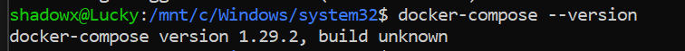
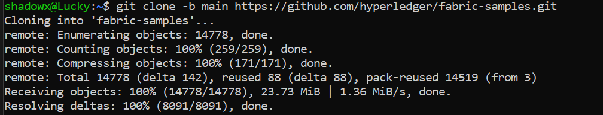

# Hyperledger Fabric Test Network Setup

This project demonstrates the basic setup and execution of Hyperledger Fabric using its official sample repository. The steps below walk through installing prerequisites, cloning the Fabric samples, and running the test network using the `network.sh` script.

---

## 📌 Prerequisites Installation

### 1. Install Go (Golang)
We begin by installing Go, which is required for building Fabric binaries.

```bash
sudo apt install golang-go
```

**Screenshot:**


---

### 2. Check Docker Installation

```bash
docker --version
```

**Screenshot:**


---

### 3. Check Docker Compose Installation

```bash
docker-compose --version
```

**Screenshot:**



---

### 4. Verify Directory Structure

Before proceeding, check the current directory structure:

```bash
ls
```

**Screenshot:**


---

## 📅 Cloning Fabric Samples

### 5. Clone Hyperledger Fabric Samples

```bash
git clone -b main https://github.com/hyperledger/fabric-samples.git
```

**Screenshot:**



---

### 6. Navigate to the Fabric Samples Directory

```bash
cd fabric-samples
```

**Screenshot:**


---

### 7. Download Binaries and Docker Images

```bash
curl -sSL https://bit.ly/2ysbOFE | bash -s
```

**Screenshot:**


---

## 🚀 Running the Test Network

### 8. Navigate to the Test Network Folder

```bash
cd test-network
```

---

### 9. Bring Up the Network

```bash
./network.sh up
```

**Screenshot:**


---

### 10. Create a Channel

```bash
./network.sh createChannel
```

**Screenshot:**


---

### 11. Shut Down the Network

```bash
./network.sh down
```

**Screenshot:**


---

## ✅ Conclusion

This setup demonstrates the basic workflow of initializing and interacting with a Hyperledger Fabric test network. It includes installing required tools, setting up the test environment, and executing network scripts.

---

