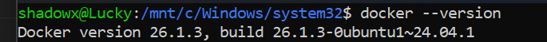
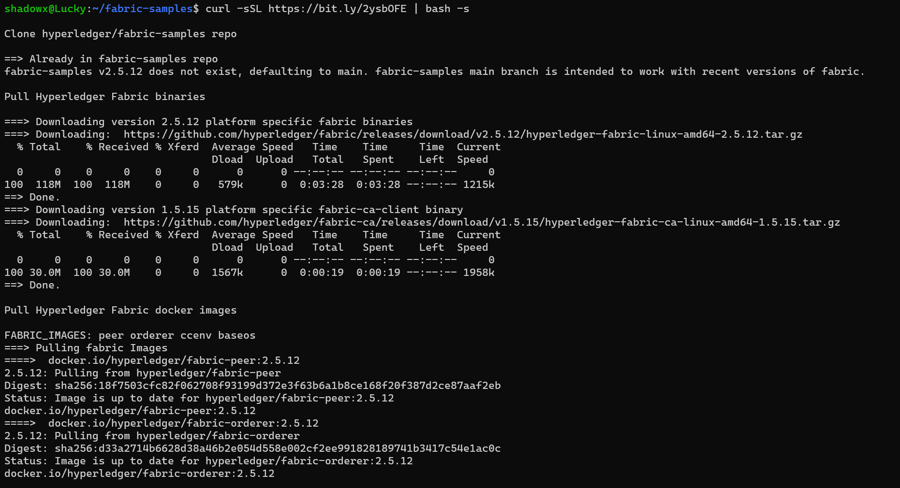
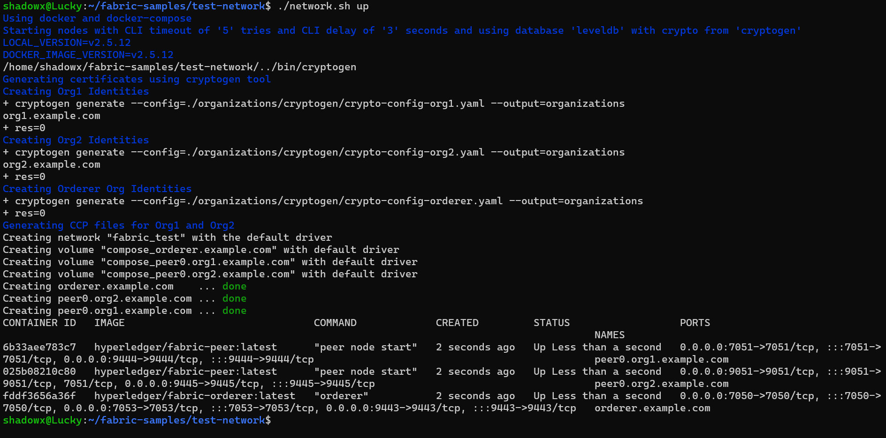
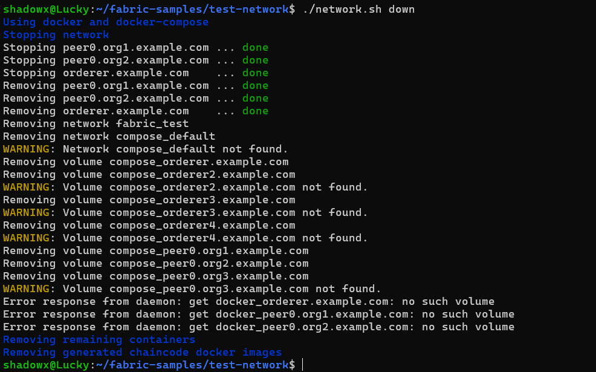

# Hyperledger Fabric Test Network Setup

This project explains how to set up and run a basic Hyperledger Fabric test network using its official sample repository. It includes installing the required tools, downloading the Fabric samples, and using the `network.sh` script.

---

## Prerequisites Installation

### 1. Install Go (Golang)
Go is needed to build Fabric binaries.

```bash
sudo apt install golang-go
```

**Screenshot:**


---

### 2. Check Docker Installation

```bash
docker --version
```

**Screenshot:**



---

### 3. Check Docker Compose Installation

```bash
docker-compose --version
```

**Screenshot:**


---

### 4. Verify Directory Structure

Check the current directory structure:

```bash
ls
```

**Screenshot:**


---

## Cloning Fabric Samples

### 5. Clone the Fabric Samples Repository

```bash
git clone -b main https://github.com/hyperledger/fabric-samples.git
```

**Screenshot:**


---

### 6. Go to the Fabric Samples Directory

```bash
cd fabric-samples
```

**Screenshot:**


---

### 7. Download Binaries and Docker Images

```bash
curl -sSL https://bit.ly/2ysbOFE | bash -s
```

**Screenshot:**



---

## Running the Test Network

### 8. Navigate to the Test Network Folder

```bash
cd test-network
```

---

### 9. Start the Network

```bash
./network.sh up
```

**Screenshot:**



---

### 10. Create a Channel

```bash
./network.sh createChannel
```

**Screenshot:**


---

### 11. Shut Down the Network

```bash
./network.sh down
```

**Screenshot:**



---

## Conclusion

This setup shows how to install tools and run a basic Hyperledger Fabric test network. It includes starting the network, creating a channel, and stopping everything afterward.

---

